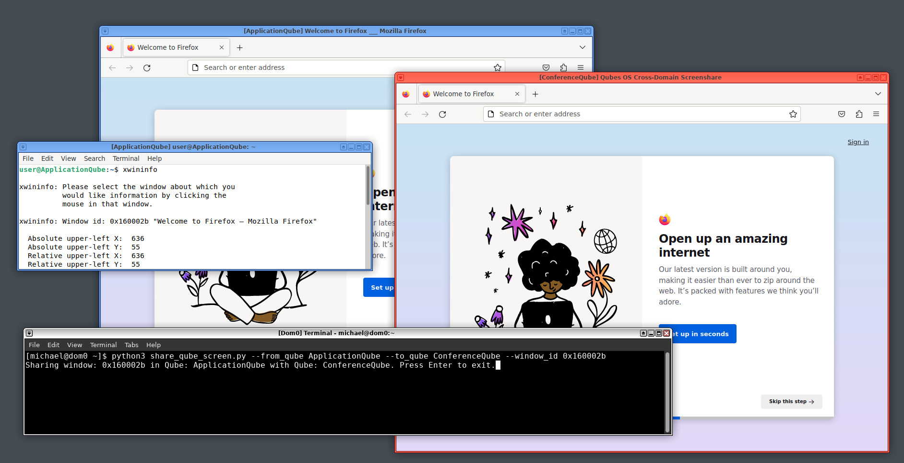

# Qubes OS Screenshare

Allows for a window running inside of one Qube to be safely shared with another Qube.

This can be useful for sharing a screencast of an application running in one Qube with
another Qube running a video conferencing software such as Zoom.

## Dependencies

### Debian Template VM

- `python3-gi`
- `python3-pil`
- `python3-xlib`

## Installation

1. Copy the `qvm-screenshare-client.py` and `qvm-screenshare-server.py` files under the
`/usr/local/bin` directory for each AppVM that you would like to use in the screen sharing.

2. Copy the `share_qube_screen.py` script into your home directory in dom0.

:warning: Since `share_qube_screen.py` runs in _dom0_, it is recommended that you vet the script before running it. :warning:

## Usage

1. In the Qube with the application to be shared, run `xwininfo` to get the Window ID of the
application window to be shared.

2. In dom0, run `python3 share_qube_screen.py --from_qube {{ ApplicationQube }} --to_qube {{ ConferenceQube }} --window_id {{ Window ID From Step 1 }}`

## Limitations

- Currently, only a window size of 1024x768 is supported. This resizing will automatically happen when `share_qube_screen.py` runs.
